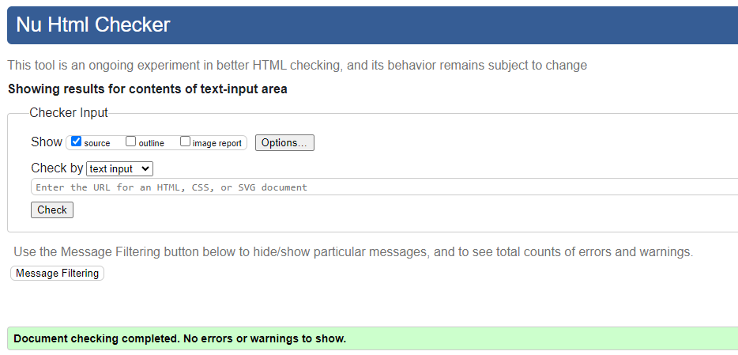

# Afro Tour
[Afro Tour](https://amba2018.github.io/afro-tour/) is a website where users can sign up for sightseeing and cultural experience in Ghana formally known as Gold Coast. This 8-day cultural experience in Ghana includes visits to 
* W.E.B Dubois Memorial Centre, 
* Independence Square, 
* Accra Arts & Crafts Centre, 
* Kwame Nkrumah Memorial Park, 
* Manhyia Palace Museum, 
* Assin Manso Slave River, 
* Adanwomase, Ntonso Village, 
* Elmina Castle and more.

The website also attempts to provide information to users who want and are looking for a relaxing holiday for themselves or with their families.
View the live site [here](https://amba2018.github.io/afro-tour/)


## Features

### Site wide
* Navigation Menu
    * Contains links to the Home, Gallery, Signup and Contact pages and will be responsive on all devices.
    * This will allow users to easily navigate between the pages within the site on any size device. 


* Footer
    * This will contain icons as links to social media websites that will open in new tabs. Icons will be accessible to the visually impaired who may be using a screen reader, by the use of aria labels. The second part of the footer will contain the copyright information.
    * This will allow the user to follow '[Afro Tour](https://amba2018.github.io/afro-tour/)' on various social media where they can get more up to date information that may not be displayed on the website. The contact information will allow the user to contact '[Afro Tour](https://amba2018.github.io/afro-tour/)' directly.

    

* Favicon
    * A site wide favicon will be implemented with a customised Peacock emblem.
    * This will provide an image in the the tabs header to allow the user to easily identify the website if they have multiple tabs open.

     

### Home Page
* Home page image
    * This will be a Hero images taken from some of the cultural events images.

 

* Itinerary 
    * Information about the itinerary will be shown here.
    * This information lets the user know what to expect from the agency. 

    

### Gallery Page
* Gallery
    * The gallery will provide the user with photos of previous tour and cultural events. The gallery will be fully responsive on all devices.
    * As the gallery is responsive it will allow the user to view content from any device.

    

### Signup form
* A signup form will be implemented to allow users to register. The form will consist of the following fields and attributes: 
  * Title (required, type=text)
  * First Name (required, type=text)
  * Middle Name (optional, type=text)
  * Last Name (required, type=text)
  * Address (required, type=text)
  * Additional address space (optional, type=text)
  * Postal Code (required, type=text)
  * Country (required, type=text)
  * Email (required, type=email) 

* On successful registration, the user will be navigated to signup_response.html displaying a congratulations message.
    


### Contact form
* A contact section will be implemented to allow users to contact '[Afro Tour](https://amba2018.github.io/afro-tour/)' either by telephone or email.  


### Existing Features

* Responsive design
* Responsive gallery
* Signup form and congratulations page

### Features not yet Implemented 
* As a future enhancement, the signup page will be updated with age input field and a textarea for users to input additional requests or inquiry.
* The Contact Us page will be moved from a part on the index page to its own page, complete with a textarea where users can email the agency. 

## Design

### Wireframes

Home page


<br><br>
Gallery page


<br><br>
Signup page


<br><br>
Contact page


<br><br><br><br>

## Technologies

* HTML
    * The structure of the Website was developed using HTML as the main language.
* CSS
    * The Website was styled using custom CSS in an external file.
* Gitpod
    * The website was developed using Gitpod IDE
* GitHub
    * Source code is hosted on GitHub and delpoyed using Git Pages.
* Git 
    * Used to commit and push code during the development opf the Website
* Font Awesome
    * Icons obtained from https://fontawesome.com/ were used as the Social media links in the footer section. 
* XConvert
    * https://www.xconvert.com was used to reduce the size of the images used throughout the website
* Favicon.io
    * favicon files were created at https://favicon.io/favicon-converter/ 
* balsamiq
    * wireframes were created using balsamiq from https://balsamiq.com/wireframes/desktop/#

## Testing
### Responsiveness

All pages were tested to ensure responsiveness on screen sizes from 320px and upwards as defined in [WCAG 2.1 Reflow criteria for responsive design](https://www.w3.org/WAI/WCAG21/Understanding/reflow.html) on Chrome, Edge, Firefox and Opera browsers.

Steps to test:

1. Open browser and navigate to [Afro Tour](https://amba2018.github.io/afro-tour/)
2. Open the developer tools (right click and choose inspect)
3. Set to responsive and decrease width to 320px
4. Set the zoom to 50%
5. Click and drag the responsive window to maximum width

Expected:

Website is responsive on all screen sizes and no images are pixelated or stretched.
No horizontal scroll is present.
No elements overlap.

Actual:

Website behaved as expected. The website was and is responsive on all screens. 
Time constrain made it impossible to test for bugs on other browsers.

Website was also opened on the following devices and no responsive issues were seen:

- iPhone 14 Pro
- Samsung Galaxy S20 plus
- Samsung Galaxy Fold
- Samsung Galaxy Tablet

### Accessibility

[Wave Accessibility](https://wave.webaim.org/) tool was used throughout development and for final testing of the deployed website to check for any aid accessibility testing.

Testing was focused to ensure the following criteria were met:

- All forms have associated labels or aria-labels so that this is read out on a screen reader to users who tab to form inputs
- Color contrasts meet a minimum ratio as specified in [WCAG 2.1 Contrast Guidelines](https://www.w3.org/WAI/WCAG21/Understanding/contrast-minimum.html)
- Heading levels are not missed or skipped to ensure the importance of content is relayed correctly to the end user
- All content is contained within landmarks to ensure ease of use for assistive technology, allowing the user to navigate by page regions
- All not textual content had alternative text or titles so descriptions are read out to screen readers
- HTML page lang attribute has been set
- Aria properties have been implemented correctly
- WCAG 2.1 Coding best practices being followed

Manual tests were also performed to ensure the website was accessible as possible and an accessibility issue was identified.

Issue #1: Image sizes in gallery was too large.

Fix: I could not find a way to fix this issue. I resized my images but only inproved preformance by 6%.

### Lighthouse Testing


### Functional Testing

**Navigation Links**

Testing was performed to ensure all navigation links on the respective pages, navigated to the correct pages as per design. This was done by clicking on the navigation links on each page.

| Navigation Link | Page to Load    |
| --------------- | --------------- |
| Home            | index.html      |
| Gallery         | gallery.html    |
| Signup          | signup.html     |

Links on all pages navigated to the correct pages as exptected.

**Form Testing**

The form on the home page was tested to ensure it functioned as expected when correct data was input and when incorrect data was input. The following test scenarios were covered:

_Scenario One - Correct Inputs_

Steps to test:

1. Navigate to [Afro Tour - Signup page](https://amba2018.github.io/afro-tour/signup.html)
2. Scroll down to the form and input the following data:
   - Title: Mr
   - First Name: John
   - Last Name: Doe
   - Address: Johnstr. 10
   - Postal Code: 45256
   - Country: Italy
   - Email: doe.john@test.com
3. Click Submit
4. User should be redirected to signup_response.html congratulations page

Expected:

Form submits with no warnings or errors and user is redirected to signup_response.html congratulations page.

Actual:

Website behaved as expected with no errors or warnings and redirected to signup_response.html.

_Scenario Two - Missing Required Field 

Steps to test:

1. Navigate to [Afro Tour - Signup page](https://amba2018.github.io/afro-tour/signup.html)
2. Scroll down to the form and input the following data:
   - Title: 
   - First Name: 
   - Last Name: 
   - Address: Johnstr. 10
   - Postal Code: 45256
   - Country: Italy
   - Email: doe.john@test.com
3. Click Submit

Expected:

The form does not submit and an Error is displayed to tell the user that the field is required.

Actual:

Website behaved as expected, error message was displayed and the form did not submit.

### Validator Testing 

 HTML
  - No errors were returned when passing through the official [W3C validator](https://validator.w3.org)




- CSS
  - No errors were found when passing through the official [(Jigsaw) validator](https://jigsaw.w3.org)


### Unfixed Bugs
Gallery images too large and needs resizing. I was unable to resolve this bug on time but will address in a future release.

## Deployment

### Version Control

The site was created using the Gitpod code editor and pushed to github to the remote repository ‘afro-tour’.

The following git commands were used throughout development to push code to the remote repo:

```git add .``` - This command was used to add the file(s) to the staging area before they are committed.

```git commit -m “commit message”``` - This command was used to commit changes to the local repository queue ready for the final step.

```git push``` - This command was used to push all committed code to the remote repository on github.

### Deployment to Github Pages

- The site was deployed to GitHub pages. The steps to deploy are as follows: 
  - In the GitHub repository, navigate to the Settings tab 
  - From the menu on left select 'Pages'
  - From the source section drop-down menu, select the Branch: main
  - Click 'Save'
  - A live link will be displayed in a green banner when published successfully. 

The live link can be found here - https://amba2018.github.io/afro-tour/

### Clone the Repository Code Locally

Navigate to the GitHub Repository you want to clone to use locally:

- Click on the code drop down button
- Click on HTTPS
- Copy the repository link to the clipboard
- Open your IDE of choice (git must be installed for the next steps)
- Type git clone copied-git-url into the IDE terminal

The project will now of been cloned on your local machine for use.

### Content 

All content are for educational purposes. Most of the images are from local curators and guides in the tourism industry.

## Credits

Love-running
*Insight from this tutorial was used to create my Website. Styles were changed to suit the styling on my Website.

[Gareth-McGirr](https://github.com/Gareth-McGirr) my mentor provided great advise in times of need.
